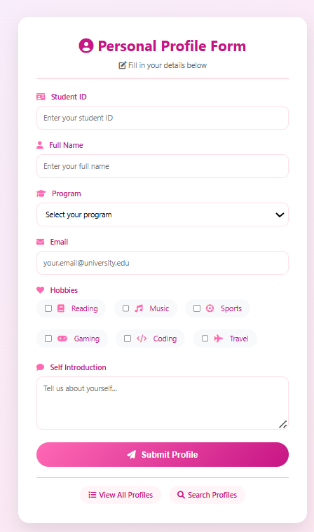
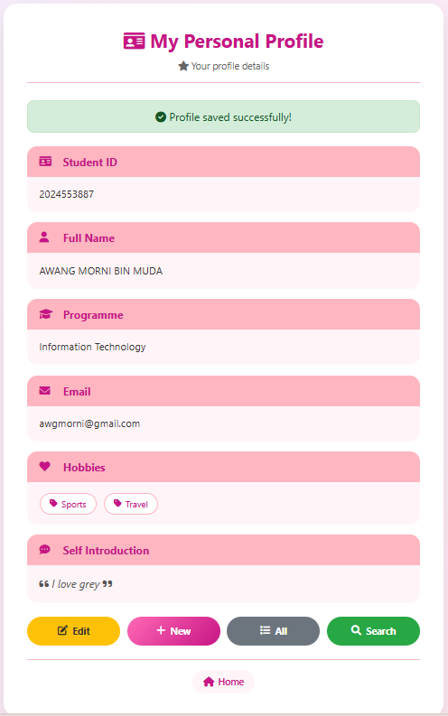
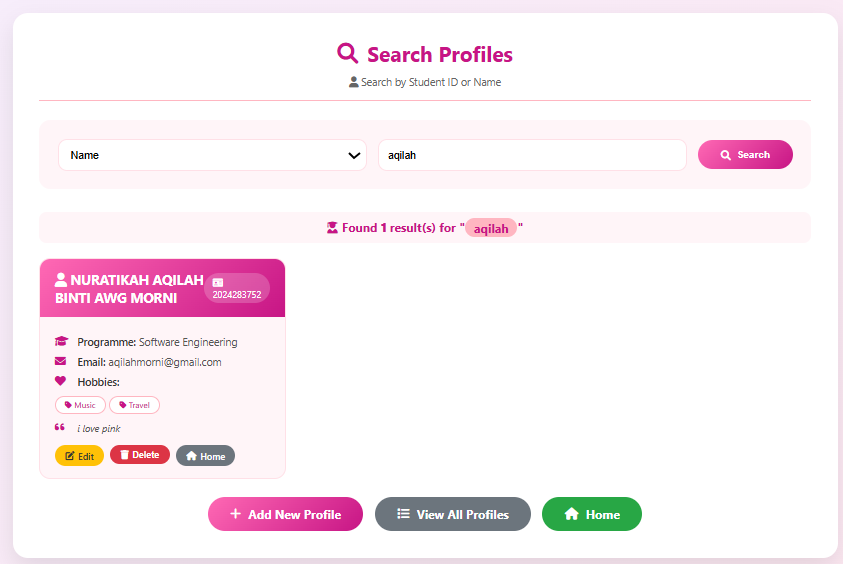
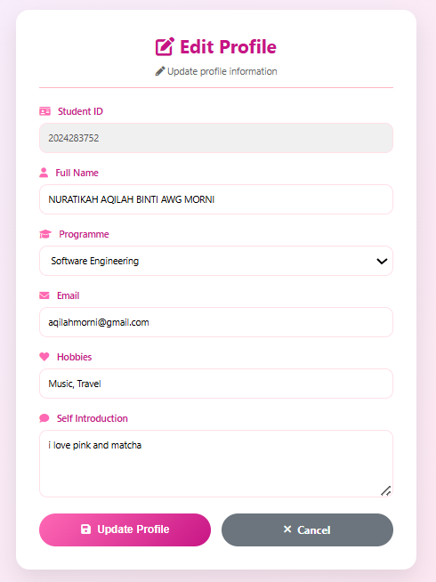

# CSC584 Assignment 2 - Profile Management System

---

## Student Information
| **Name** | Nuratikah Aqilah Binti Awg Morni |
| **Student ID** | 2024283752 |
| **Course** | CSC584 |
| **Assignment** | Individual Assignment 2 |
| **Submission Date** | 21 June 2026 |

---

## Project Description

This is a **Profile Management System** developed for CSC584 Assignment 2. It allows users to create, view, edit, search, and delete student profiles. The application integrates HTML, Servlet, JSP, JavaBean, and JDBC with a database following the **MVC (Model-View-Controller)** architecture.

### System Flow:
1. User fills in the HTML form
2. Data is sent via HTTP POST to Servlet
3. Servlet creates a ProfileBean object
4. Data is saved to the database using JDBC
5. JSP pages display the information

---

## Features Implemented

### Core Features (Required)
| Feature | Status | Description |
|---------|--------|-------------|
| HTML Form | ✅ | Collects user information |
| HTTP POST Method | ✅ | Submits data to Servlet |
| Servlet Processing | ✅ | Processes form data |
| JavaBean | ✅ | ProfileBean with getters/setters |
| JDBC Integration | ✅ | Database connectivity |
| profile.jsp | ✅ | Displays single profile |
| viewProfiles.jsp | ✅ | Displays all profiles |

### Additional Features (Extra Credit)
| Feature | Status | Description |
|---------|--------|-------------|
| Edit Profile | ✅ | Update existing profiles |
| Delete Profile | ✅ | Remove profiles from database |
| Search Profile | ✅ | Search by Student ID or Name |

---

## Technologies Used

| Technology | Purpose |
|------------|---------|
| **HTML** | User interface and form |
| **CSS** | Styling, colors, and responsive design |
| **Java Servlet** | Request handling and business logic |
| **JSP** | Dynamic content display |
| **JavaBean** | Data model |
| **JDBC** | Database connectivity |
| **Apache Derby** | Database |
| **Font Awesome** | Icons |

---

## MVC Architecture

| Component | Role | Files |
|-----------|------|-------|
| **Model** | Data and business logic | ProfileBean.java, ProfileDAO.java |
| **View** | User interface | index.html, profile.jsp, viewProfiles.jsp, searchProfiles.jsp, editProfile.jsp |
| **Controller** | Request handling | ProfileServlet.java, ViewProfilesServlet.java, DeleteProfileServlet.java, SearchProfilesServlet.java, EditProfileServlet.java |

---

## Database Schema

**Database Name:** StudentProfilesDB

**Table Name:** Profile

| Column | Data Type | Constraints | Description |
|--------|-----------|-------------|-------------|
| studentID | VARCHAR(20) | PRIMARY KEY | Student identification number |
| name | VARCHAR(100) | NOT NULL | Full name of student |
| programme | VARCHAR(100) | NOT NULL | Program of study |
| email | VARCHAR(100) | NOT NULL | Email address |
| hobbies | VARCHAR(255) | | Student hobbies/interests |
| introduction | VARCHAR(500) | | Self introduction |

---

## How to Run the Project

### Prerequisites
- NetBeans IDE 8.2 or higher
- Apache Tomcat / GlassFish Server
- Java DB (Derby) installed

### Step-by-Step Instructions

1. **Open the Project**
   - Open NetBeans IDE
   - Click File → Open Project
   - Select `PersonalProfileAppDup`

2. **Start Database Server**
   - Go to Services tab
   - Expand Databases → Java DB
   - Right-click → Start Server

3. **Create Database**
   - Right-click Java DB → Create Database
   - Database Name: `StudentProfilesDB`
   - User Name: `app`
   - Password: `app`

4. **Run SQL Script**
   - Right-click on StudentProfilesDB → Execute Command
   - Run the `database.sql` script

5. **Build and Run**
   - Right-click on project → Clean and Build
   - Right-click on project → Run

6. **Access Application**
   - Open browser: `http://localhost:8080/PersonalProfileAppDup/`

---

## Project Structure
PersonalProfileAppDup/
│
├── src/
│ └── com/
│ └── profile/
│ ├── ProfileBean.java # Model - Data object
│ ├── DBConnection.java # Database connection utility
│ ├── ProfileDAO.java # Data Access Object
│ ├── ProfileServlet.java # Controller - Save profile
│ ├── ViewProfilesServlet.java # Controller - View all profiles
│ ├── DeleteProfileServlet.java # Controller - Delete profile
│ ├── SearchProfilesServlet.java # Controller - Search profiles
│ └── EditProfileServlet.java # Controller - Edit profile
│
├── web/
│ ├── index.html # Home page - Add profile form
│ ├── profile.jsp # Display single profile
│ ├── viewProfiles.jsp # Display all profiles
│ ├── searchProfiles.jsp # Search profiles page
│ ├── editProfile.jsp # Edit profile page
│ └── WEB-INF/
│ └── web.xml # Deployment descriptor
│
├── database.sql # Database creation script
├── README.md # Project documentation
└── build.xml # NetBeans build file

---

## Screenshots

### 1. Home Page - Add Profile Form

### 2. Profile Display

### 3. View All Profiles

### 4. Search Profiles

### 5. Edit Profile

---

## Sample Data

| Student ID | Name | Programme | Email | Hobbies |
|------------|------|-----------|-------|---------|
| 2024283752 | Nuratikah Aqilah Binti Awg Morni | Software Engineering | aqilahmorni@gmail.com | Music, Travel |
| 2024787443 | Nurafiqah Athirah Binti Awg Morni | Information Technology | afiqahmorni@gmail.com | Reading, Gaming |
| 2023757688 | Nurhani Afifah Binti Awg Morni | Data Science | haniafah@gmail.com | Music, Coding |

---

## GitHub Repository

**Repository Link:** https://github.com/2024283752/PersonalProfileAppDup

---

## Declaration

I hereby declare that this assignment is my original work. All sources used have been properly acknowledged.

**Signature:** Nuratikah Aqilah Binti Awg Morni  
**Date:** 21 June 2026

---

## Contact

For any questions regarding this project, please contact:
- **Email:** aqilahmorni@gmail.com
- **Student ID:** 2024283752
- **Phone No:** 0134099622

---
